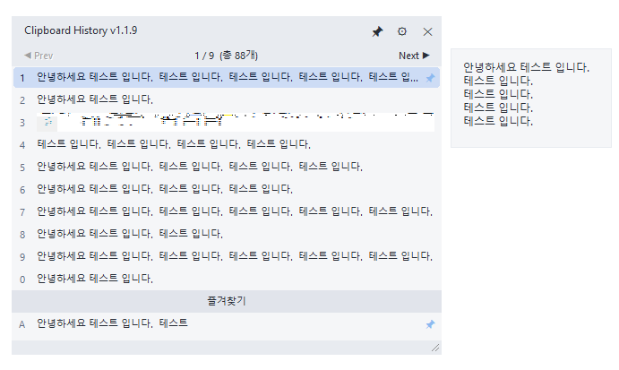
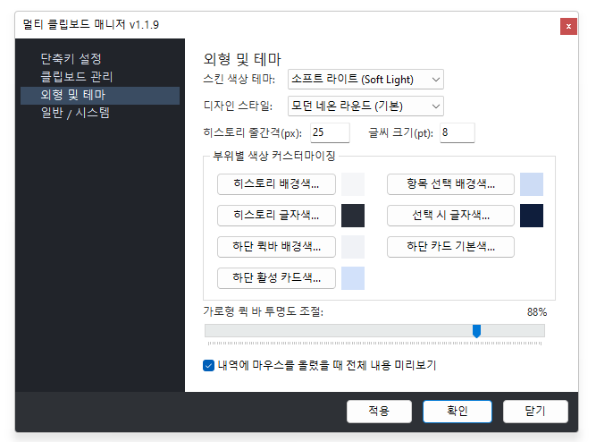
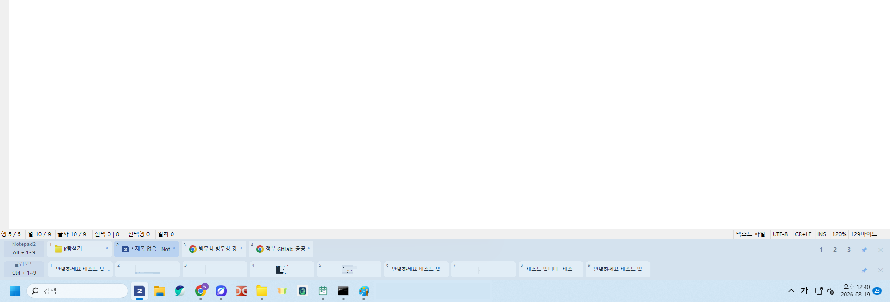

# 📋 멀티 클립보드 매니저 & 윈도우 스위처 (Clipboard Manager)

> **스마트 클립보드 히스토리 관리 및 고속 윈도우 작업공간 전환 도구**  
> Delphi VCL 네이티브 기반으로 개발되어 가볍고 빠른 반응 속도와 강력한 생산성 기능을 제공하는 Windows용 유틸리티입니다.

---

## 📦 최신 배포판 다운로드 (Latest Release)

| 항목 | 정보 |
| :--- | :--- |
| **최신 버전** | **`v1.2.0`** (안정화 버전) |
| **업로드 일자** | **2026년 08월 19일** |
| **다운로드 링크** | 📥 **[ClipboardManager.zip 다운로드](ClipboardManager.zip)** *(무설치 포터블 패키지, 약 2.36 MB)* |
| **실행 방법** | 압축 해제 후 `ClipboardManager.exe` 바로 실행 (별도 설치 불필요) |
| **지원 환경** | Windows 10 / 11 (32-bit & 64-bit 지원) |

---

## 📸 실제 프로그램 스크린샷 (Screenshots)

### 1. 📑 클립보드 히스토리 팝업 & 실시간 대형 미리보기

* **단축키 즉시 호출 (`Ctrl + Shift + V`)**: 저장된 최근 클립보드 내역(텍스트/이미지)이 1~0 번호 뱃지와 함께 표시됩니다.
* **독립형 실시간 대형 미리보기**: 항목에 마우스를 올리면 우측에 별도의 독립 팝업이 떠서 긴 문서나 고화질 이미지를 가림 없이 한눈에 확인할 수 있습니다.
* **즐겨찾기 고정 (Favorites)**: 자주 쓰는 상용구는 하단 즐겨찾기 영역에 `A`, `B` 등의 키로 고정하여 영구 관리합니다.
* **페이징 및 창 고정**: `◀ Prev` / `Next ▶` 페이징으로 과거 수십~수백 개의 복사 기록을 탐색할 수 있으며, 핀(Pin) 아이콘으로 창을 상시 고정할 수 있습니다.

---

### 2. 🎨 직관적인 환경설정 & 세부 테마 커스터마이징

* **테마 및 스타일 프리셋**: `소프트 라이트`, `다크`, `모던 네온 라운드` 등 다양한 비주얼 스타일 제공.
* **세부 UI 커스텀**: 히스토리 줄간격(px), 폰트 크기(pt), 배경색, 글자색, 선택 강조색, 카드 색상 등 픽셀 단위로 커스터마이징 가능.
* **퀵 바 투명도 조절**: 바탕화면 하단 퀵바의 투명도(Alpha)를 슬라이더로 부드럽게 조절.
* **전체 탭 구성**: `단축키 설정`, `클립보드 관리(저장개수/중복방지)`, `외형 및 테마`, `일반 / 시스템(시작 시 자동 실행)` 지원.

---

### 3. ⚡ 화면 하단 데스크톱 퀵바 (QuickBar & Window Switcher)

* **상단 라인 - 윈도우 스위처 (`Alt + 1~9`)**: 현재 실행 중인 프로그램 창(`탐색기`, `메모장`, `브라우저` 등)을 번호 슬롯에 배치하여 원클릭 또는 `Alt + 숫자` 키로 즉시 화면 전환.
* **작업공간(Workspace) 프리셋 (1, 2, 3)**: 다중 프로그램 창 배치를 슬롯별로 기억해두고 언제든 원클릭으로 작업 환경 복원.
* **하단 라인 - 클립보드 고속 붙여넣기 (`Ctrl + 1~9`)**: 최근 복사된 항목들을 작업표시줄 상단에서 바로 확인하고 원하는 프로그램에 즉각 붙여넣기.

---

## ✨ 주요 핵심 기능 요약 (Key Features)

1. **스마트 클립보드 모니터링 & 로컬 SQLite DB 저장**
   - 텍스트 및 이미지 복사 데이터 실시간 감지 및 안전한 로컬 보관
   - 중복 항목 무시 및 최대 저장 개수 설정
2. **키보드 뱃지 고속 붙여넣기 (Quick Paste)**
   - 마우스 클릭 없이 번호/알파벳 키 입력만으로 이전 복사 기록 즉시 입력
3. **윈도우 스위처 (Window Switcher) & 멀티태스킹 최적화**
   - 번호 기반 초고속 창 전환 및 무지연(Zero-Lag) 더블 버퍼링 UI
4. **데스크톱 상시 퀵바 (QuickBar)**
   - 작업표시줄 위 컴팩트 바 형태로 상시 대기 및 투명도 지원
5. **완벽한 한국어 UI & 초경량 네이티브 실행**
   - UTF-8 BOM 인코딩 완벽 지원 및 트레이 상주로 리소스 점유율 극소화

---

## ⌨️ 기본 단축키 (Default Hotkeys)

| 기능 | 기본 단축키 | 설명 |
| :--- | :--- | :--- |
| **클립보드 히스토리 팝업** | `Ctrl + Shift + V` | 저장된 클립보드 목록을 띄우고 뱃지 키로 즉시 붙여넣기 |
| **데스크톱 퀵바 토글** | `Ctrl + Shift + Q` | 화면 하단 퀵바 보이기 / 숨기기 |
| **윈도우 스위처 팝업** | `Alt + Shift + W` | 실행 중인 윈도우 번호 슬롯(1~9) 팝업 호출 |
| **고속 붙여넣기 프리픽스** | `Ctrl + Win` | 단축키 조합을 통한 고속 붙여넣기 |
| **윈도우 전환 프리픽스** | `Alt` | Alt + 번호키로 빠른 창 전환 |

> 💡 *모든 단축키는 메인 설정 화면([단축키 설정] 탭)에서 원하는 키 조합으로 자유롭게 변경할 수 있습니다.*

---

## 📁 프로젝트 구조 (Project Architecture)

```
clipboardmanager/
├── ClipboardManager.dpr      # 프로그램 엔트리 포인트
├── ClipboardManager.dproj    # Delphi 프로젝트 파일
├── ClipboardManager.zip      # 최신 빌드 및 배포 패키지 (v1.2.0)
├── screenshot/               # 실제 프로그램 스크린샷 (1.png, 2.png, 3.png)
│
├── uMainForm.pas / .dfm      # 메인 설정 및 트레이 관리 화면
├── uClipboardMonitor.pas     # Windows 클립보드 체인 모니터링 엔진
├── uDatabase.pas             # SQLite 기반 클립보드/설정 데이터베이스 관리
├── uHotkeyManager.pas        # 전역 단축키 등록 및 이벤트 디스패처
├── uHistoryPopupForm.pas/.dfm# 클립보드 히스토리 팝업 및 대형 미리보기
├── uQuickBarForm.pas / .dfm  # 바탕화면 고정형 컴팩트 퀵바 UI
├── uWindowSwitcherForm.pas/.dfm # 윈도우 고속 전환 및 작업공간 프리셋 관리
├── uFavEditForm.pas / .dfm   # 즐겨찾기 편집 대화상자
├── uThemeManager.pas         # UI 테마 / 색상 / 스타일 관리자
├── uLog.pas                  # 디버깅 및 에러 로깅 유틸리티
│
├── build.bat                 # 자동 빌드 스크립트
└── banana.ico / .png / .bmp  # 애플리케이션 아이콘 리소스
```

---

## 🛠️ 빌드 및 실행 방법 (Build & Run)

### 요구 사항
- **Embarcadero Delphi 10.x / 11.x / 12.x** 이상 (VCL)
- **Windows 10 / 11** (32-bit & 64-bit 지원)

### 실행 방법
1. 저장소의 **[`ClipboardManager.zip`](ClipboardManager.zip)**을 다운로드하여 압축을 풉니다.
2. `ClipboardManager.exe`를 실행하면 시스템 트레이에 아이콘이 상주하며 즉시 사용하실 수 있습니다.

---

## 📄 라이선스 (License)
This project is open-sourced under the MIT License.
